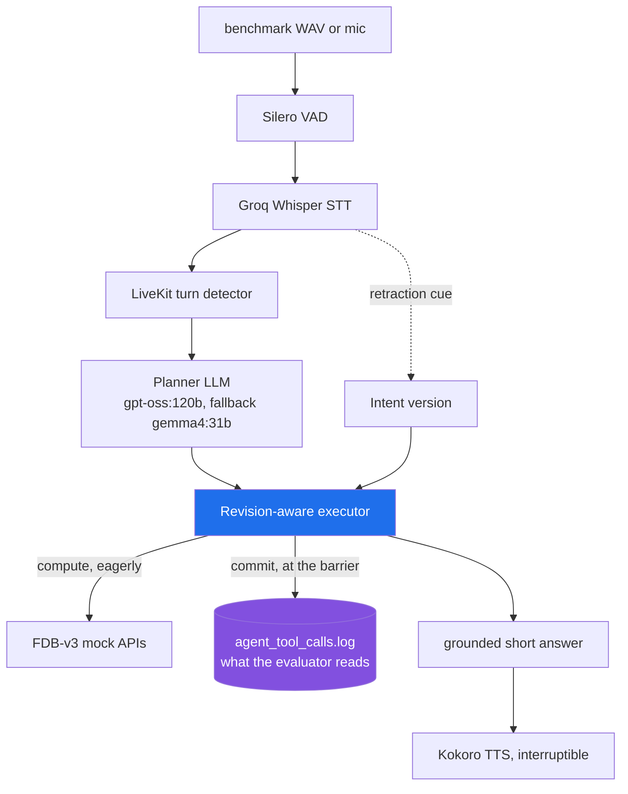

# Interruptible Real-Time Voice Agent — Theme 05

A LiveKit voice agent for Full-Duplex-Bench v3 (FDB-v3), built around one idea:
**executing a tool and committing a tool are different acts, and only the second
one is irreversible.**

## 1. The problem

FDB-v3 plays human-recorded speech full of real disfluency — fillers, pauses,
false starts and self-corrections — at a voice agent, and scores the tool calls
it makes. 21 of the 100 scenarios are self-correction tests: the speaker states
a value and then retracts it.

```
"set the max price to 3000 ... wait, actually, change the max price to 3500"
```

The expected answer is **one** `update_search_filter` call carrying 3500. The
evaluator's pass criterion is strict: every expected tool called, with correct
arguments, and **no extra calls**. Logging both 3000 and 3500 fails the scenario
as completely as calling nothing at all.

## 2. Why interruption is difficult

The information you need in order to decide whether to commit arrives *after*
the point at which you would have had to start working to answer in time. That
is a speculation problem, not a prompting problem.

Three properties of the benchmark make it sharp:

- **The input is semantically non-monotonic.** Tokens arrive in order, but
  meaning does not — a later token can retract an earlier one.
- **The output deadline is hard.** The harness records the agent for exactly as
  long as the input WAV lasts, so the answer must *begin* within roughly the
  1.5 s of trailing silence after the user stops.
- **Acceptance is all-or-nothing.** Precision is scored as strictly as recall.

A conventional LLM + tool-calling agent has no way to express "I ran this, but
I have since learned it was retracted." Execution and commitment are the same
act, so a correction leaves a wrong call permanently in the record.

## 3. Architecture



| Layer | Model | Where | Key |
|---|---|---|---|
| VAD | Silero | local | — |
| Turn detection | LiveKit `EnglishModel` | local | — |
| STT | `whisper-large-v3-turbo` | Groq API | `GROQ_API_KEY` |
| Planner | `gpt-oss:120b` → fallback `gemma4:31b` | Ollama Cloud | `OLLAMA_API_KEY` |
| TTS | Kokoro-82M (`af_heart`) | local Python server | — |
| Transport | LiveKit Cloud | hosted | `LIVEKIT_URL`, `LIVEKIT_API_KEY`, `LIVEKIT_API_SECRET` |
| Judge (benchmark) | gpt-4o | OpenAI | `OPENAI_API_KEY` |

Both planner models were confirmed available on Ollama Cloud with tool support.
All keys live in `.env` (template: `.env.example`); none are committed.

## 4. Our innovation — revision-aware tool execution

`agent/revision.py`. The invariant:

> **A stale execution may finish computing, but it must never commit a side effect.**

The mock APIs are pure, so running a tool is cheap and reversible; appending to
the telemetry log is the only irreversible act. Separating them gives three
mechanisms, in the order they fire:

1. **Deduplication** — an identical `(tool, args)` call executes and logs once.
   Concurrent identical calls coalesce onto one future.
2. **Slot supersession** — calls are keyed by the *target* they act on, not by
   their arguments. `("update_search_filter", "max_price")` is one slot, so
   3000 and 3500 collide and only the last survives. Legitimate repeats are
   untouched, because every scenario that genuinely expects two calls to one
   function differs in exactly that target argument (`doc_type`, `bill_type`,
   `filter_name`, `order_id`, `product_id`, currency pair) — these slot keys
   were derived from the benchmark's own ground truth, not guessed.
3. **Intent versioning** — every execution records the intent version it was
   planned under. A retraction cue in the final transcript bumps the version,
   and anything planned under an older one is stale. State-changing calls are
   re-validated **after** execution as well as before, which closes a window the
   previous point-sample check missed entirely.

Commit is deferred to a barrier (the agent reaching the `speaking` state, plus a
shutdown safety net). Execution still starts the instant a call is planned, and
the logged timestamps are the real execution times — so deferring the write
costs nothing on the latency metrics while letting the committed set be decided
once the turn has settled. Emitting in issue order also matches the evaluator's
positional pairing of same-named calls.

Structured events on every transition: `INTENT_CREATED`, `INTENT_REVISED`,
`TASK_STARTED`, `TASK_CANCELLED`, `TASK_STALE`, `TASK_COMMITTED`,
`DUPLICATE_SUPPRESSED`.

## 5. Extension — in-car destination change

```bash
python -m extension.demo --both
```

The same executor, unchanged, driving a simulated head unit with real mutable
state, so the invariant becomes visible. Each tool is split into a pure
`compute` half and a side-effecting `apply` half; `commit` is what moves the car.

| | Routes computed | State changes | Outcome |
| --- | --- | --- | --- |
| Without protection | 4 | 4 | Car briefly guided to the retracted destination; navigation starts twice |
| With protection | 3 | 2 | Only the airport is applied; navigation starts once |

Details in [extension/README.md](extension/README.md).

## 6. Setup and reproduction

### Offline checks — no keys, no GPU, no data

```bash
bash scripts/verify.sh
```

Syntax check, imports, 17 unit tests, and the extension demo. Runs anywhere
Python 3.10+ does, including Windows via Git Bash. This is the fastest way to
confirm the innovation behaves as described.

### Full benchmark

Requirements: Ubuntu 22.04, Python 3.10, NVIDIA GPU + CUDA 12.x, and
`apt install ffmpeg unzip espeak-ng python3.10-venv`. No Docker needed.

```bash
cp .env.example .env    # fill in keys
bash scripts/run_fdb_v3.sh
```

The script pins FDB-v3 to commit `3e799c45` (verified as upstream `main`),
installs deps, downloads the data, starts the local Kokoro server, runs a
preflight (keys, provider reachability, and a tool-call smoke test on both
planner models), runs all 100 scenarios, evaluates with the LLM judge, and
writes everything — scores, logs, `pip freeze`, secrets-stripped config — to
`eval/results/<timestamp>/`.

For a fast subset during development: `bash scripts/smoke_test.sh`.

## 7. Results

**Not yet measured.** The benchmark has not been run on this branch. Running it
requires four API keys, a LiveKit Cloud project, an Ubuntu host with CUDA for
the NeMo ASR the harness uses, and the ~100-sample audio set — none of which
were available on the machine this branch was written on.

The innovation is verified by unit tests and the extension demo, not by a
benchmark delta. **No claim is made here about F1, argument accuracy, pass rate
or latency, and no baseline-versus-innovation comparison has been performed.**
The honest next step is to run `scripts/run_fdb_v3.sh` twice — once with
`REVISION_AWARE=0` semantics (i.e. commit-on-execute) and once as shipped — and
fill this section from `eval/results/`.

## 8. Repo layout

```
agent/        revision.py (the innovation) · tools.py (12 tools) · main.py (worker)
              providers.py · prompts.py · config.py · latency.py · kokoro_server.py
extension/    nav.py · demo.py — in-car destination change
tests/        test_revision.py — 17 tests, stdlib only
scripts/      verify.sh (offline) · run_fdb_v3.sh (full) · smoke_test.sh · preflight.py
eval/results/ scores, logs, config per run
```

## 9. Known limitations

- **The benchmark has not been run.** Everything in §7 is unmeasured.
- **Slot supersession cannot catch a change of target.** "Track order A1 — no,
  B2" produces two different slots. Intent versioning covers it only when the
  retraction cue is recognised; the cue list in `revision.py` is a fixed regex,
  not a learned model.
- **The commit barrier fires when the agent starts speaking.** A correction
  arriving after that cannot retract an already-committed call. This is
  deliberate — the log is genuinely irreversible — but it means very late
  corrections are unrecoverable.
- **Mock latency stays at `instant`**, matching the reference `cascaded_agent.py`
  and therefore every published baseline. The benchmark's own scenario metadata
  declares `normal` for 78 of 100; running at `instant` makes the
  correction-during-execution window vanish. `MOCK_LATENCY=normal` is the honest
  stress test and has not been run.
- **`update_search_filter` keeps a `str` schema** and coerces to bool/number
  before logging, rather than declaring a union type, to avoid risking tool
  registration on an untested LiveKit schema path.
- **Turn-detector timing is untuned.** `min_silence 0.55` + `MIN_ENDPOINTING_DELAY
  0.5` is roughly a 1.0 s trigger, against scenarios containing literal
  `"um...... um...... um"`. 29 scenarios carry PAUSE or HESITATION features.
- Some FDB-v3 ground truth is noisy (`travel_02` expects `P9-9-9-90011` for a
  spoken `P-8-8-9-9-0-0-1-1`), so a perfect score is not attainable.
